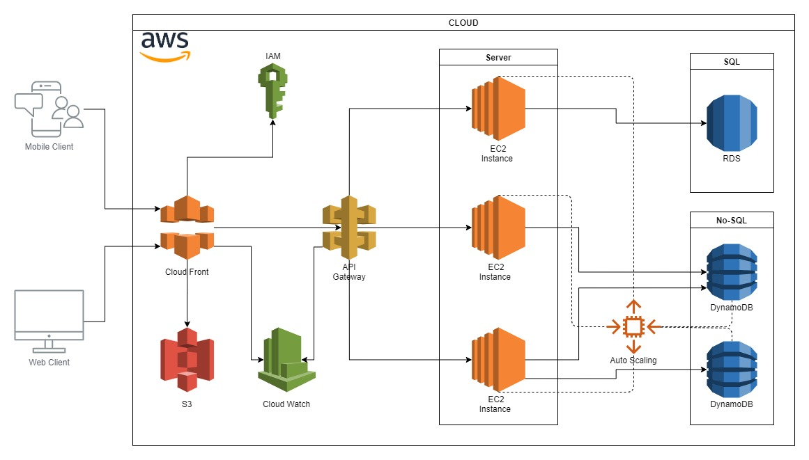
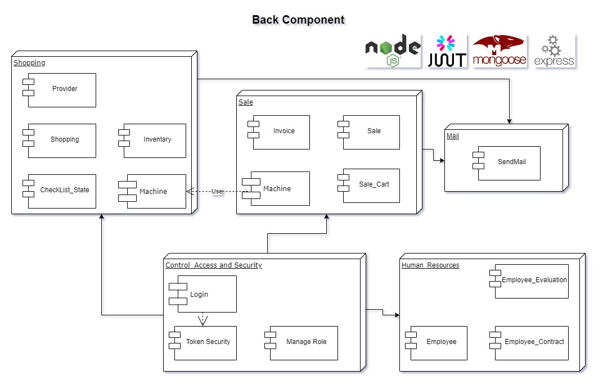
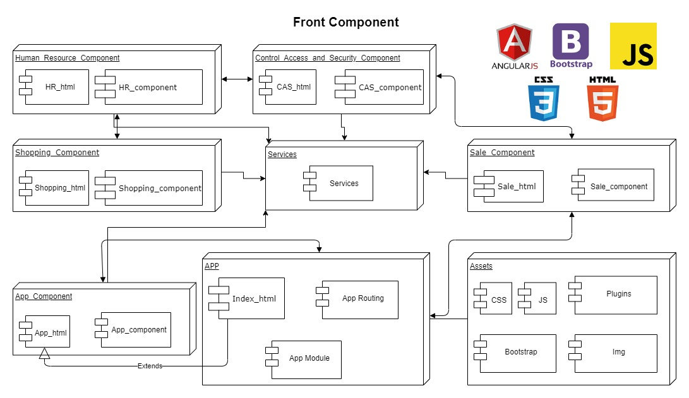
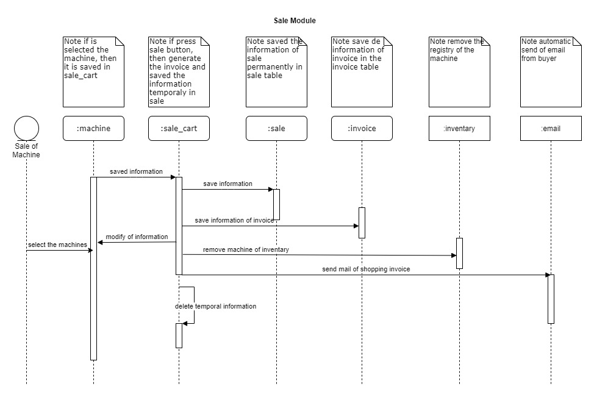
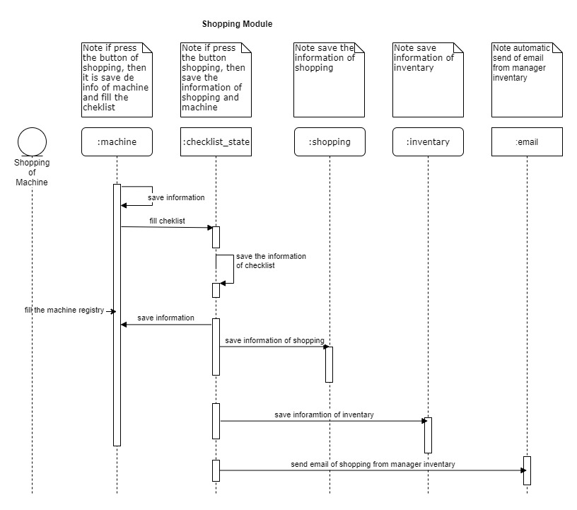
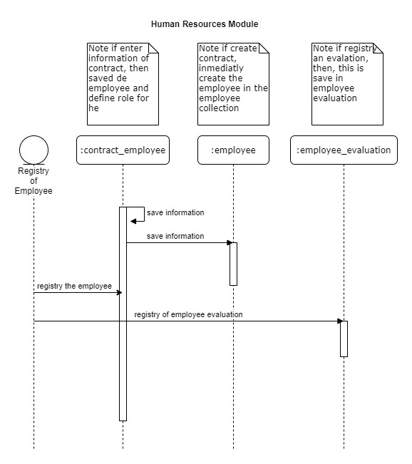
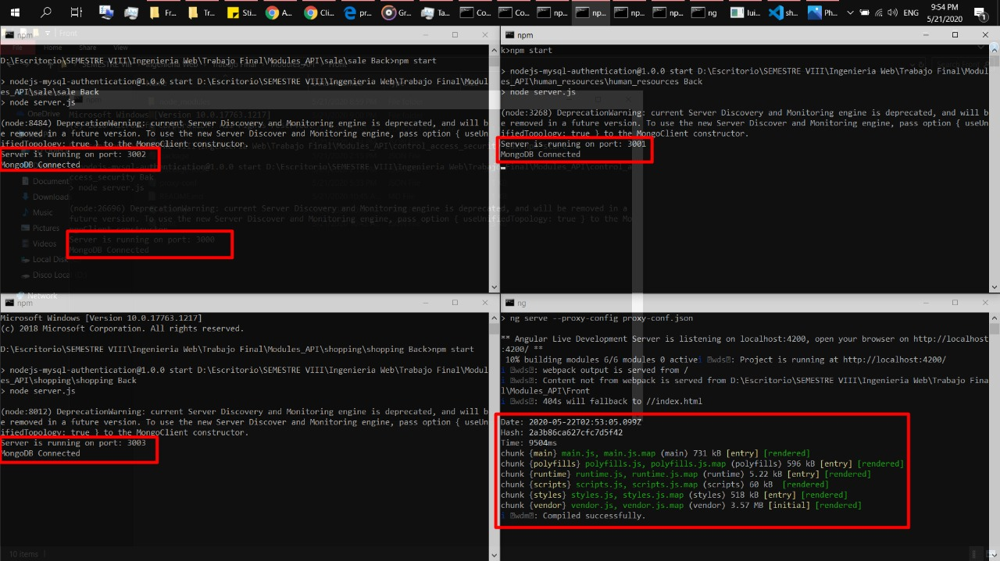
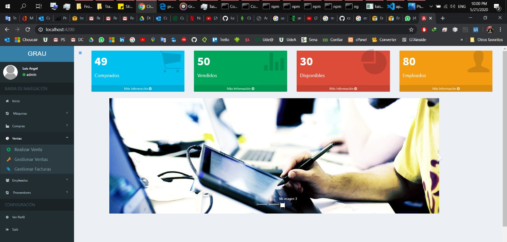

# sales_machine_app
Application of sales for machines with architecture in microservices and API Rest technology

# Technologies
* MongoDB (No-sql DB)
* Mongoose ODM
* Express (Middleware)
* Node JS (Server Back)
* Angular (Front)
* Bootstrap, HTML, CSS, JS 

# Version
* Angular CLI: 9.0.7
* Node: 12.16.1
* OS: win32 x64
* OS: Ubuntu 18.04

# Architecture
App Infrastructurein the AWS Cloud

BackEnd Components

FrontEnd Components

# System Analysis

Sales Module Secuence

Shoping Module Secuence

Human Resources Module Secuence

# Result Execution

4 Microservices running 4 moudules local

Application running in browser local

# Result Deloy in AWS

Link of video: https://youtu.be/LWWmPydKAzo

# Result Microservices working in the App

Link of video: https://youtu.be/FWKmsdJb0RI

# Dependency:
    `npm install ng2-slim-loading-bar --save`
    `npm i ng2-search-filter --save`

# Initial Configuration
Clone the repo and execute `npm install` in the Node js server and into the Angular client.

## Execution of Data Base MongoDB
1. Execute the command `mongod `
2. Èxecute the command `mongo`
3. Execute into the mongo: `use nombre_bd`

## Execution of NodeJS Server
1. In the CMD, go to the server path
2. Enter the command `npm run dev`

## Execution of Angular Client
1. In the CMD, go to the server path
2. Enter the command `npm start`

# Error Solutions
For Error with: `rxjs` Go to the package.json and change: `"^6.1.0"` for this: `"6.1.0"`

# How the App Works

## Server Node JS
* Use the `server.js` for connecting to our database MongoDB y set the routes and define the port where will running the app
* Use the model entity file `Employee.js` for build our entity in the database mongoDB from the mongoose
* Use the routes for to create the business logic, Registers, login, find, etc.

## Client Angular
* Use the `proxy-config` for that instead of using: localhost:3000/ we will use: /employees
* In the `package.json` we tell him that starting the server with the proxy that I created previously
* Use the `Authentication.service.ts` for to create the methods that we will use for our authentication service
* Use the `Auth-guard.service.ts` for management the sesion and see the user logged and to verificate the sesion expired
* Use the `app.module.ts` for to declare the routes in the front and more (other restrictions)
* Use the `app.component.ts` for to indicate the use of our authentication service in ours base page (menu)
* Use the `app.component.html` for paste our html from menu
* For the additional components, it is used the same that previously described in the last steps

